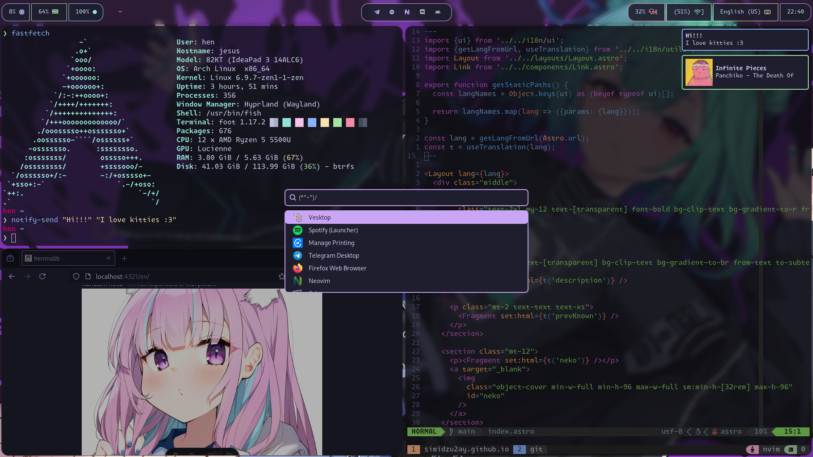

# Installation

```bash
sudo pacman -Suy --needed git stow neovim mako wofi hypland hyprpaper fish starship foot swaylock waybar
git clone https://github.com/simidzu2ay/dotfiles.git
cd dotfiles
stow .
```


